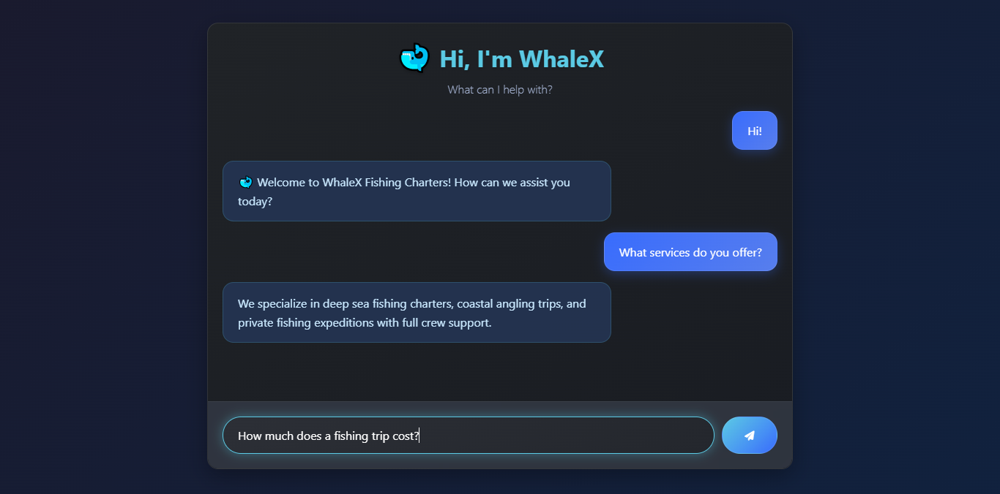

# WhaleX ChatBot 🐋  

  

**A fishing industry chatbot** trained on custom data to answer FAQs about trips, pricing, and more. Built with **Python, Flask, and ChatterBot**, and designed with **HTML, CSS, and JavaScript**.  

---

## Features ✨  
- Answers FAQs about fishing charters, pricing, locations, and policies.  
- Custom **AI-generated JSON dataset** for realistic training.  
- Simple and responsive UI with ocean-themed design.  
- Real-time interaction using Flask APIs.  

---

## Tech Stack 💻
- Python
- ChatterBot
- Flask
- HTML
- CSS
- JavaScript
- JSON

## Installation 🛠️  

1. **Clone the repository**:  
```bash
git clone https://github.com/hussain-jawaid/CodeAlpha_ChatBot_WhaleX
